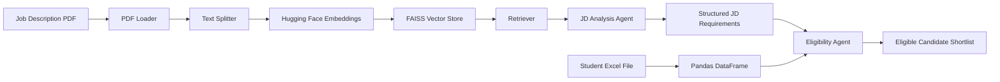

# Intelligent Placement System

## 1. Project Overview

The Intelligent Placement System is an AI-assisted placement screening system. It reads a job description from a PDF, extracts the role requirements, loads student information from an Excel workbook, and identifies students whose skills match the job requirements.

The system is designed to reduce manual placement screening effort and make candidate selection more consistent and traceable.

## 2. Technology Stack

### Programming Language

- Python

### Artificial Intelligence and Large Language Model

- Google Gemini through `langchain-google-genai`
- Configured model: `gemini-3.6-flash`
- Pydantic structured output for reliable requirement extraction
- `python-dotenv` for loading the Google API key from environment variables

### Retrieval-Augmented Generation

- LangChain for pipeline orchestration
- `PyPDFLoader` for reading PDF files
- `RecursiveCharacterTextSplitter` for splitting documents into chunks
- Hugging Face embeddings
- Sentence Transformer model: `sentence-transformers/all-MiniLM-L6-v2`
- FAISS for vector storage and similarity search
- LangChain retriever configured to return the top two relevant chunks

### Data Processing

- Pandas for reading and processing student records
- OpenPyXL for Excel file support
- Pypdf for PDF processing

### Presentation Generation

- `python-pptx` for generating the evaluation presentation

## 3. Input and Output

### Input Files

1. Job Description PDF
   - Location: `Data/Python_Full_Stack_Developer_Fresher_JD.pdf`
   - Contains the role, responsibilities, required skills, and optional skills.

2. Student Excel Workbook
   - Location: `Data/student_data_100.xlsx`
   - Contains 100 student records.
   - Important columns include:
     - `Name`
     - `Roll No`
     - `10th Percent`
     - `12th Percent`
     - `Graduation Percent`
     - `Skills`

### Output

The system produces a list of eligible students containing:

- Student name
- University roll number
- 10th percentage
- 12th percentage
- Graduation percentage
- Skills

## 4. High-Level Architecture



## 5. Detailed Execution Flow

### Step 1: Load the Job Description

`PDFLoader` uses LangChain's `PyPDFLoader` to read the job description PDF and convert its pages into document objects.

File: `ingestion/pdf_loader.py`

### Step 2: Split the Document

`TextSplitter` divides the PDF text into smaller chunks so that relevant sections can be retrieved efficiently.

Current configuration:

- Chunk size: 500 characters
- Chunk overlap: 50 characters

File: `ingestion/text_splitter.py`

### Step 3: Generate Embeddings

Each text chunk is converted into a numerical vector using the Hugging Face model:

```text
sentence-transformers/all-MiniLM-L6-v2
```

These vectors represent the semantic meaning of the JD content.

File: `vectorstore/embeddings.py`

### Step 4: Store Vectors in FAISS

FAISS stores the generated vectors and enables fast similarity search over the job description content.

File: `vectorstore/embeddings.py`

### Step 5: Retrieve Relevant JD Content

The retriever receives the query:

```text
What are the eligibility criteria and required skills for this job?
```

It returns the two most relevant document chunks.

File: `vectorstore/retriever.py`

### Step 6: Analyze the Job Description

The JD Analysis Agent sends the retrieved context to Gemini. Gemini extracts only information explicitly mentioned in the job description.

The agent is instructed to:

- Extract the job role
- Extract required qualification
- Extract minimum 10th percentage if available
- Extract minimum 12th percentage if available
- Extract minimum graduation percentage if available
- Extract mandatory technical skills
- Extract required experience
- Avoid inventing information
- Avoid treating optional skills as mandatory

File: `agents/jd_agent.py`

### Step 7: Validate the Extracted Requirements

The extracted result is returned using the Pydantic `JDRequirements` model.

```text
JDRequirements
├── job_role
├── required_qualification
├── minimum_10th_percentage
├── minimum_12th_percentage
├── minimum_graduation_percentage
├── required_technical_skills
└── required_experience
```

This creates a predictable structure for the eligibility stage.

### Step 8: Load Student Data

Pandas reads the Excel workbook and stores the student records in a DataFrame.

File: `main.py`

### Step 9: Check Eligibility

The Eligibility Agent processes each student's skill list.

The current matching process:

1. Read the student's comma-separated skills.
2. Remove extra spaces.
3. Convert skills to lowercase.
4. Compare them with the required technical skills.
5. Include the student only when all required skills match.

File: `agents/eligibility_agent.py`

### Step 10: Display the Shortlist

The final candidates are printed with their personal, academic, and skill information.

The current runnable entry point is:

```text
main.py
```

## 6. Main Components

### PDF Loader

Responsible for reading the job description PDF and returning document pages.

### Text Splitter

Converts large document pages into smaller searchable chunks.

### Embedding Module

Converts text chunks into semantic vectors and creates the FAISS vector store.

### Retriever

Finds the most relevant job-description content for the analysis query.

### JD Analysis Agent

Uses Gemini to interpret the job description and produce structured requirements.

### Eligibility Agent

Compares extracted requirements with student skills and creates the candidate shortlist.

## 7. Source Job Description Summary

The source JD is for a Python Full Stack Developer Fresher role.

### Responsibilities

- Develop and maintain web applications
- Build REST APIs and backend services
- Work with databases and optimize queries
- Collaborate with UI/UX and product teams
- Debug and test applications
- Improve application performance
- Participate in code reviews and Agile development

### Required Skills

- Python fundamentals
- HTML
- CSS
- JavaScript
- Flask, Django, or a similar backend framework
- React, Angular, Vue, or a similar frontend framework
- SQL
- Git
- Problem-solving

### Good-to-Have Skills

- Internship or project experience
- AWS, GCP, or Azure
- Docker
- CI/CD basics

## 8. Evaluation Mapping

### Problem Identification and Requirement Analysis: 10 Marks

The problem is the manual and time-consuming process of comparing a job description with a large student database.

The system addresses this by:

- Reading an unstructured JD PDF
- Extracting structured job requirements
- Reading student data from Excel
- Automatically comparing requirements with student profiles

### Process Analysis and RPA Solution Design: 10 Marks

The system follows a repeatable automation pipeline:

```text
PDF Input
  -> Text Extraction
  -> Text Chunking
  -> Embedding Generation
  -> FAISS Retrieval
  -> JD Analysis Agent
  -> Structured Requirements
  -> Student Data Loading
  -> Eligibility Matching
  -> Candidate Shortlist
```

The system separates job-description interpretation from candidate matching, making the design easier to understand and maintain.

### Proposed Solution, Novelty, and Feasibility: 10 Marks

#### Proposed Solution

An AI-assisted candidate screening pipeline that combines document retrieval, LLM-based requirement extraction, and deterministic eligibility matching.

#### Novelty

- Uses an AI agent to interpret job descriptions.
- Uses RAG to retrieve relevant JD content before analysis.
- Uses Pydantic for structured and validated output.
- Separates the JD Analysis Agent and Eligibility Agent.
- Keeps the final eligibility rule understandable and auditable.

#### Feasibility

- Built with commonly available Python libraries.
- Uses existing PDF and Excel files as inputs.
- Can process batch student records.
- Can be extended with a web interface, ranking, reports, and database storage.

## 9. Current Implementation Status

### Implemented

- PDF loading
- Text splitting
- Hugging Face embedding generation
- FAISS vector storage
- Similarity retrieval
- Gemini-based job-description analysis
- Pydantic structured output
- Excel student loading
- Skill-based eligibility matching
- Candidate shortlist output
- Evaluation presentation generation

### Empty or Not Yet Implemented

- `app.py` is currently empty.
- `graph/workflow.py` is currently empty.
- `ingestion/excel_loaader.py` is currently empty.
- There is currently no web interface.
- There is currently no persistent database.
- There is currently no candidate ranking system.

## 10. Current Limitation

The JD Analysis Agent extracts academic percentage requirements, but the current Eligibility Agent checks only technical skills.

The following conditions are not yet applied during eligibility filtering:

- Minimum 10th percentage
- Minimum 12th percentage
- Minimum graduation percentage
- Required qualification
- Required experience
- Skill synonyms such as treating Flask and Django as related backend skills

This should be explained honestly during evaluation. The current prototype proves the main AI and retrieval workflow, while academic filtering and ranking are recommended next improvements.

## 11. Recommended Future Improvements

1. Apply academic percentage thresholds during eligibility checking.
2. Normalize related technologies such as Flask, Django, React, Angular, and Vue.
3. Add a match-reason field for every candidate.
4. Rank candidates instead of returning only a yes/no result.
5. Add a Streamlit or web-based interface.
6. Add CSV, Excel, and database export options.
7. Add logging and error handling for missing data.
8. Add unit tests for extraction and eligibility rules.
9. Add a configurable requirement policy for different companies.
10. Store previous JDs and screening results for future comparison.

## 12. Demonstration Plan

During the evaluation presentation:

1. Open the job-description PDF.
2. Show the extracted JD requirements.
3. Open the 100-row student workbook.
4. Run `main.py`.
5. Show the retrieved JD context.
6. Show the structured Gemini output.
7. Show the eligible student shortlist.
8. Explain the current skill-based matching behavior.
9. Mention academic filtering and ranking as the next improvement.

## 13. One-Line Conclusion

The Intelligent Placement System converts an unstructured job description and a student Excel database into a repeatable, AI-assisted, and explainable candidate-screening workflow.
